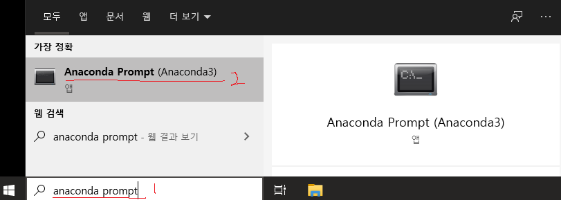
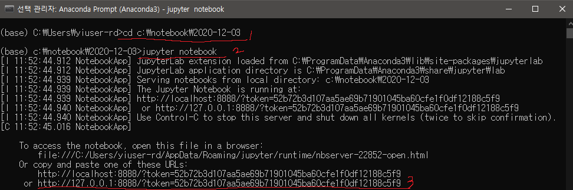

---

---
```
conda update conda
conda install PACKAGE
conda update PACKAGE

conda create —name ENVNAME python=3.6
conda create —clone ENVNAME —name ENVNAME
conda env remove —name ENVNAME

conda env list
activate ENVNAME
conda list

condal install PACKAGE    #tensorflow keras numpy matplotlib
pip install PACKAGE    #pydicom
```

```python
!nvidia-smi
!pip freeze

from google.colab import drive
drive.mount(‘/content/gdrive/’)

import os
import shutil
os.chdir(‘???’)
!pwd    #print working directory
```
